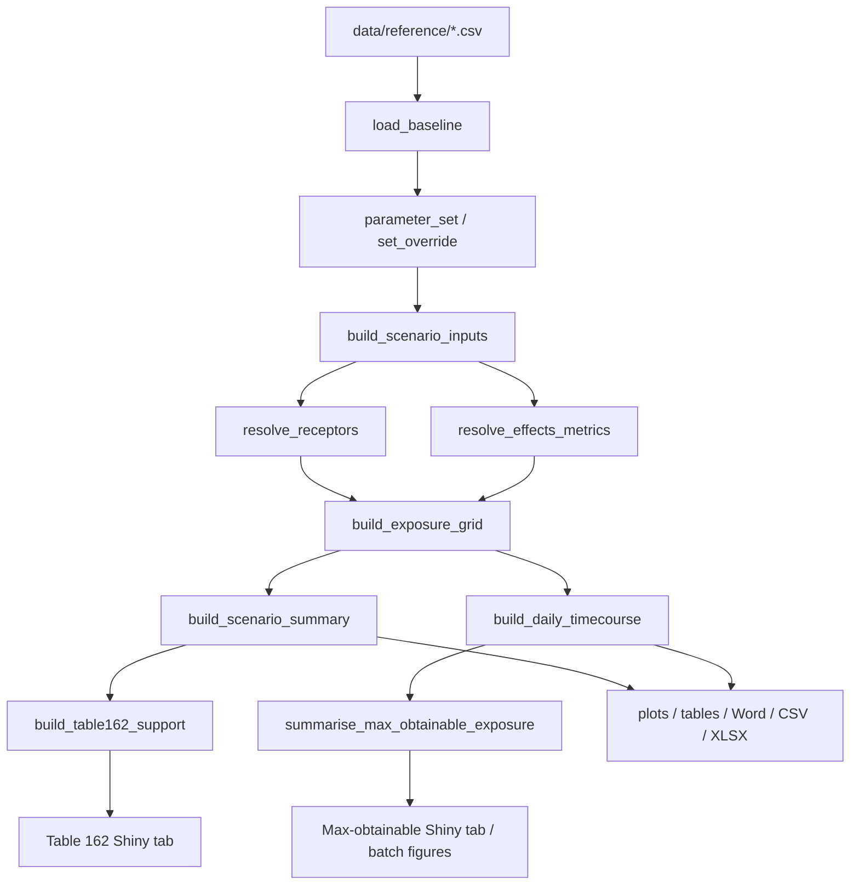
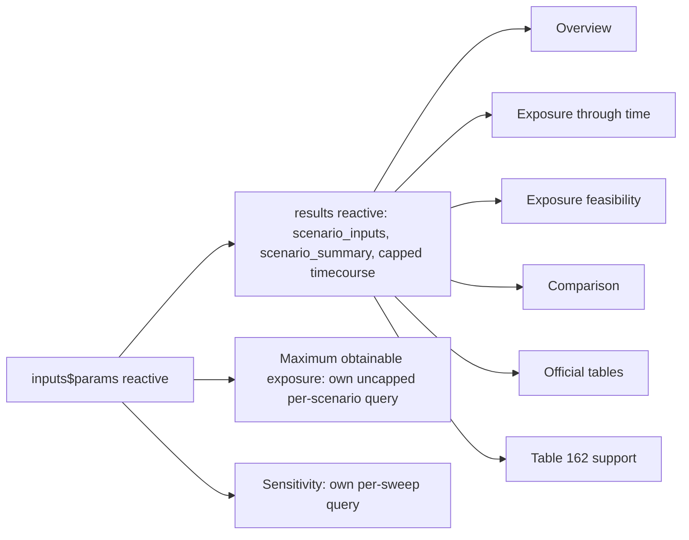

# Current implementation inventory — `stbam`

**Purpose:** a stand-alone, evidence-based description of what this application
currently is, for a scientific/regulatory reviewer who did not write it.
Documentation is treated as evidence, not as ground truth — every material
claim below was checked against the executable code, the reference data, or a
live run, as of the commit stated below. Where documentation and code
disagreed, both are stated and the code's actual behaviour is identified as
authoritative.

**Repository:** `C:\MonDossierMartin\R\seed_treatment_bam_model`
**Git commit at time of writing:** `a2f7ec1` (branch `main`, working tree
clean, 1 commit ahead of `origin/main`)
**Method:** direct reading of every file under `R/`, `data/reference/`,
`tests/`, `scripts/`, and `docs/`; targeted R reproductions run against the
live engine to confirm specific claims (marked "Verified live" below); no
project file was modified to produce this document.

---

## 1. Executive summary

`stbam` is an R/Shiny reimplementation of the calculation engine behind a
thiamethoxam bird-and-mammal seed-treatment risk assessment. It is a **source
tree**, not an installed package (no `DESCRIPTION`, no CRAN access on this
machine), loaded by sourcing files in a fixed order via `R/load_model.R`. It
consists of: a pure calculation engine; a reference-data layer read from CSV;
a baseline-plus-override parameter system; four canonical result datasets;
plotting, table, CSV/XLSX and Word export functions; an 8-tab Shiny dashboard;
a static batch figure-generation script; and 12 `testthat` files (587
assertions, 0 failures at the commit above).

The engine has been through two independent adversarial reviews (not
self-certified): a 100-item audit of the core calculation chain
(`docs/independent_engine_audit.md`, zero confirmed/potential numerical
errors) and a 19-item review of a later "maximum obtainable exposure"
addition (`docs/max_obtainable_exposure_review.md`, three confirmed reporting
defects found and fixed, the underlying arithmetic passed outright). One
scientific judgement item from that second review remains open (§15, item
R1) and one **newly confirmed, previously undocumented defect** was found
while producing this inventory (§15, item R7 — the "Exposure through time"
and "Exposure feasibility" tabs silently drop most crops from their dropdown
menus once more than 24 scenario rows are in play).

The project has been developed across multiple sessions by two different AI
coding agents working in the same working tree without branch isolation
(documented candidly in `PROJECT_STATE.md`); this inventory treats the
current state of the files as the object of study regardless of authorship.

---

## 2. Scope and method

This document does not modify any production file. Two very small throwaway
R scripts were written to a scratch directory outside the project
(`C:\Users\MLemay\AppData\Local\Temp\claude\...\scratchpad\`) to verify
specific runtime claims (crop-name matching between reference tables, and the
24-row time-course slice behaviour); their output is quoted where used and
they were not added to the project.

Every section distinguishes:
- **Verified live** — reproduced by running R against the current code.
- **Verified by reading** — confirmed by reading the source directly (not run).
- **Documentation says** — a claim from `docs/*` not independently re-checked
  in this pass, flagged where it could not be confirmed.
- **Rationale not determined from available project evidence** — used
  wherever a design choice's motivation could not be established from code,
  comments, commit messages or documentation.

---

## 3. Project architecture

The project is organised in five R layers, loaded in a fixed order by
`R/load_model.R`'s `load_stbam(root, include = c("core","reporting","shiny"))`:

```
R/calculations/   pure functions, no I/O, no side effects
R/inputs/         reference-data loading + baseline/override parameter layer
R/summaries/      canonical dataset builders (the four datasets in §9)
R/reporting/      plots, tables, Word/CSV/XLSX export, figure metadata
R/shiny/          the dashboard; contains no scientific calculation itself
```

`include = "core"` loads the first two layers only (sufficient for scripted
use and tests); `"reporting"` adds the third; `"shiny"` adds the fourth. This
is why an earlier session's test run appeared to fail — omitting `"shiny"`
from `load_stbam()` makes every Shiny-layer function genuinely undefined, not
broken (self-corrected in that session, recorded in `PROJECT_STATE.md`).

**Design principle stated in code comments and consistently followed:** every
consumer (Shiny tab, CSV export, Word export) reads from the same canonical
dataset via the same builder function. `build_official_table()` is the single
entry point for the Shiny "Official tables" tab, CSV export and Word export;
there is no second implementation of any table. `format_figure_footnotes()`
(added later, §9) plays the same role for the maximum-obtainable-exposure
figures' captions across Shiny, the batch script and (implicitly) any future
Word insertion.

---

## 4. Project directory / component map

| Path | Contents | Role |
|---|---|---|
| `R/calculations/` | `00_validation.R`…`05_feasibility.R` | Pure calculation functions and shared constants (§8) |
| `R/inputs/` | `10_reference_data.R`, `11_parameter_set.R` | Reads `data/reference/*.csv` into an `stbam_baseline`; baseline+override parameter system |
| `R/summaries/` | `20_scenario_inputs.R`…`26_max_obtainable_summary.R` (note: no `25_*` file exists — a numbering gap, not a missing file) | Canonical dataset builders |
| `R/reporting/` | `30_plots.R`…`35_max_obtainable_plots.R` | Plots, official tables, Word/CSV/XLSX export, figure metadata/footnotes |
| `R/shiny/` | `40_modules_inputs.R`…`44_module_max_obtainable.R` | Shiny UI/server modules |
| `R/load_model.R` | — | Sourcing order controller |
| `app/app.R` | — | `shiny::runApp` entry point; calls `run_stbam_app()` |
| `data/reference/` | 13 CSV files | Immutable assessment-baseline reference data (§5) |
| `data/scenarios/`, `data/processed/` | `.gitkeep` only | Unused placeholders — no code currently reads or writes here (Verified by reading: no `data/scenarios` or `data/processed` path string appears anywhere under `R/` or `scripts/`) |
| `reports/`, `templates/` | `.gitkeep` only | Unused placeholders, same as above |
| `outputs/` | Gitignored, regenerable | Written by `scripts/build_canonical_outputs.R` and `scripts/generate_priority_exposure_figures.R` (§10) |
| `inst/fixtures/` | 1 CSV, 28 rows | Independently-reconstructed regression fixtures from a prior review phase |
| `audit/` | 1 CSV, 100 rows | Row-level output of the core-engine independent audit |
| `scripts/` | 8 files | Environment check, canonical build, static figure batch, reviewer walkthrough, app launcher, two Python static-reading helpers (pre-existing, for workbook extraction, not part of the runtime app) |
| `tests/testthat/` | 12 files, 587 assertions | Automated test suite (§13) |
| `docs/` | 17 files | Documentation, including the two independent-review reports |
| `dependencies.lock.json` | — | Custom substitute for `renv.lock` (§12) |

---

## 5. Input / reference-data inventory

All files below are under `data/reference/`, are read read-only, and are
never written to by the application (Verified by reading: no `write_csv`,
`write.csv` or similar call targets any path under `data/reference/`
anywhere in `R/`). Row counts exclude the header row.

| File | Rows | Purpose | Key columns | Read by | Used by |
|---|---:|---|---|---|---|
| `source_manifest.csv` | 6 | Provenance of the 6 source calculation workbooks | `workbook_key`, `file_name`, `sha256`, `role` | `load_baseline()` (`R/inputs/10_reference_data.R`) | Shiny "Assessment defaults" sub-tab; quantitative-appendix Word export |
| `crop_seeding_parameters.csv` | 85 | Broad agronomic reference ("EAD Seed Weight and Seeding Rate Report") — TKW bounds, seeding-rate bounds (direct or mass-basis), planting-method availability booleans | `crop`, `tkw_low/high_g_per_1000`, `seeding_rate_*`, `seeds_per_ha_low/high` (+`_basis`), `*_seeded` booleans | `load_baseline()` | `build_scenario_inputs()` (crop row lookup, resolved per-corner, not via `seeds_per_ha_low/high` — see §15 item R2) |
| `scenario_definitions.csv` | 157 | The crop × rate-level × workbook rows that actually carry a registered application rate | `workbook`, `crop`, `rate_level`, `application_rate`, `application_rate_unit` | `load_baseline()` | `build_scenario_inputs()` — this is the join that gates which crops can be modelled at all; a crop in `crop_seeding_parameters.csv` with no row here cannot be selected |
| `planting_method_parameters.csv` | 4 | Surface-seed fraction by planting method (de Snoo & Luttik 2004) | `planting_method`, `planting_method_label`, `surface_seed_fraction` | `load_baseline()` | `build_scenario_inputs()` |
| `receptor_parameters.csv` | 6 | Body weight, FIR regression coefficients, precomputed baseline FIR, both MSA terms, `surface_seed_only` flag, per receptor | `receptor_id`, `taxon`, `size_class`, `body_weight_g`, `fir_coefficient_a/b`, `msa_short/long_term_m2`, `surface_seed_only` | `load_baseline()` | `resolve_receptors()` |
| `fir_regressions.csv` | 10 | Alternative food-intake-rate regression library (10 forms) | `taxon`, `regression_name`, `coefficient_a`, `exponent_b`, `n_species` | `load_baseline()` | Not read by any function under `R/calculations`, `R/inputs` or `R/summaries` (Verified by reading — grep for `fir_regressions` finds only the loader). **Apparently unused beyond storage** — see §15 item R3 |
| `effects_metrics.csv` | 16 | Toxicological reference values, one row per metric | `metric_id`, `taxon`, `duration_class`, `metric_role`, `endpoint_value`, `uncertainty_factor`, `effects_metric`, `unit`, `source` | `load_baseline()` | `resolve_effects_metrics()` |
| `dissipation_parameters.csv` | 2 | The two DT50 defaults | `parameter`, `value` (`residue_dt50_days`=10, `surface_seed_dt50_days`=14) | `load_baseline()` | `resolve_dissipation()` |
| `review_core_assumptions.csv` | 24 | Copied read-only from the sibling document-review project's own register | `assumption_id`, description columns | `read_reference()` inside `build_table162_support()`'s registers loader — **not directly**; see note below | Cross-reference material for `docs/*`, not joined into any canonical dataset by code (Verified by reading: `load_table162_registers()` in `R/summaries/24_table162_support.R` reads only `table162_decision_matrix.csv` and `table162_considerations.csv`, not this file) |
| `review_effects_metrics.csv` | 21 | Same review project, effects-metric register | `metric_id`, endpoint/provenance columns | Not read by any R function under `R/` (Verified by reading) | Documentation cross-reference only |
| `table162_considerations.csv` | 114 | Evidence/consideration register from the review project | `consideration_id`, `table162_decision_ids`, `direction`, `theme`, `concise_consideration`, `evidence_type` | `load_table162_registers()` | `build_table162_support()` |
| `table162_decision_matrix.csv` | 1,740 | One row per Table 162 crop/rate/method/receptor/effect decision cell | `decision_id`, `table_id`, `crop_family`, `application_rate`, `planting_method`, `taxon`, `effect_window`, `receptor_size`, `current_position`, `apparent_primary_rationale` | `load_table162_registers()` | `build_table162_support()` |
| `copied_register_manifest.csv` | 5 | Provenance (source path + SHA-256) for the four `review_*`/`table162_*` files copied from the sibling project | `file_name`, `source_path`, `sha256` | Not read by any R function (Verified by reading) | Documentation-only provenance record |

**Row-count note:** `crop_seeding_parameters.csv` and `scenario_definitions.csv`
are documented elsewhere in this project (`docs/data_dictionary.md`) as 86
and 158 rows respectively; the file-line counts above (85, 157) are correct
data-row counts after excluding the header. This is a units-of-counting
discrepancy in the existing documentation, not a data problem — see §14.

### `review_core_assumptions.csv` and `review_effects_metrics.csv` are loaded but not joined

Both files are read by `load_baseline()` — **verify this claim precisely**:
Verified by reading `R/inputs/10_reference_data.R`'s `load_baseline()`
function — it reads exactly 8 tables (`crops`, `planting_methods`,
`receptors`, `fir_regressions`, `effects_metrics`, `dissipation`,
`scenarios`, `source_manifest`). **`review_core_assumptions.csv`,
`review_effects_metrics.csv`, `table162_considerations.csv` and
`table162_decision_matrix.csv` are NOT part of the `stbam_baseline` object
at all.** They are read separately, only inside
`load_table162_registers()` in `R/summaries/24_table162_support.R`, and
that function reads only two of the four
(`table162_decision_matrix.csv`, `table162_considerations.csv`). This
corrects an error in the table above as first drafted and is stated here
explicitly per this document's own verification discipline (§15, item R4).

---

## 6. Inputs not stored in reference CSV files

| Item | Value / definition | Code location | Downstream use |
|---|---|---|---|
| `STBAM_RATE_UNITS` | `c("mg a.i./kg seed", "mg a.i./seed")` | `R/calculations/00_validation.R` | Validates `application_rate_unit` everywhere |
| `STBAM_PLANTING_METHODS` | `c("broadcast","drill_spring","drill_fall","precision")` | `00_validation.R` | Validates planting method inputs |
| `STBAM_CLOTHIANIDIN_MOLAR_RATIO` | `249.68 / 291.7` | `00_validation.R` | Screening-only conversion; zero call sites in production code (independently confirmed, `docs/independent_engine_audit.md` §4.4) |
| `STBAM_DEFAULT_LOC` | `1` | `00_validation.R` | RQ level-of-concern threshold, added as a named constant so it is not scattered as a literal `1` (see §15 item R5 for where this guarantee still has a gap) |
| `STBAM_MODEL_VERSION` | `"1.2.0"` (current file content — has changed twice during this project's history; kept manually in sync with the specification's change-control table) | `00_validation.R` | Figure/export provenance |
| `STBAM_DIET_FRACTIONS` | `c(1.00, 0.50, 0.25, 0.10, 0.05, 0.01)` | `R/summaries/21_receptor_exposure.R` | Default dietary fractions evaluated everywhere a caller does not supply its own |
| `STBAM_OVERRIDABLE` | Named list of 11 overridable parameters, each with `unit`, `min`, `max`, `label` | `R/inputs/11_parameter_set.R` | Defines exactly which parameters `set_override()` will accept |
| `STBAM_PARAMETER_STATUS` | `c("ASSESSMENT_DEFAULT","USER_OVERRIDE","UPDATED_SOURCE","PROVISIONAL","REVIEWED")` | `11_parameter_set.R` | Override provenance labelling |
| `STBAM_TABLES` | Registry of the 4 official tables (builder function, title, orientation, footnote text) | `R/reporting/31_tables.R` | Single source for Shiny "Official tables" tab, CSV export, Word export |
| `STBAM_PALETTE` | 8-colour colour-blind-safe hex palette | `R/reporting/30_plots.R` | Every plot's colour scale |
| `STBAM_WORD_STYLE` | Font/size/colour constants for Word export | `R/reporting/32_word_export.R` | `stbam_flextable()` |
| `STBAM_SENSITIVITY_PARAMETERS` | Named vector mapping human labels to 8 override-eligible parameters | `R/shiny/42_module_sensitivity.R` | Sensitivity-tab parameter dropdown |
| `resolve_msa_term_for_metric()`'s policy | Birds always `"short"`; mammals `"short"` for acute, `"long"` for chronic | `R/calculations/05_feasibility.R` | Hard-coded logic, not data-driven — grounded in a specific cited assessment paragraph (`MAIN-P000209`) in the function's own documentation, but the *mapping itself* is R code, not a CSV row |
| Nagy allometric coefficients actually used | `bird_small/medium`: a=0.398, b=0.85; `bird_large`: a=0.648, b=0.651; all mammals: a=0.235, b=0.822 | Stored in `receptor_parameters.csv`, **not** hard-coded — included here only to flag that `fir_regressions.csv` stores 9 *alternative* forms that are currently unreachable (§15 item R3) |

---

## 7. Data provenance

- `crop_seeding_parameters.csv`, `scenario_definitions.csv`,
  `planting_method_parameters.csv`, `receptor_parameters.csv`,
  `fir_regressions.csv`, `effects_metrics.csv`, `dissipation_parameters.csv`,
  `source_manifest.csv` were produced by `scripts/extract_reference_data.py`
  from the 6 source calculation workbooks (SHA-256-verified before/after
  reading; hashes recorded in `source_manifest.csv`).
- `review_core_assumptions.csv`, `review_effects_metrics.csv`,
  `table162_considerations.csv`, `table162_decision_matrix.csv` were copied
  read-only from a separate, sibling document/workbook review project
  (`C:\MonDossierMartin\Python_Local\Python_Document analysis`);
  `copied_register_manifest.csv` records the exact source path and SHA-256
  for each at copy time.
- `inst/fixtures/bird_small_cereals_calculation_checks.csv` (28 rows) was
  independently reconstructed in an earlier phase of the sibling review
  project, used as a third opinion in the core-engine audit.
- `audit/independent_engine_findings.csv` (100 rows) and
  `docs/independent_engine_audit.md` were produced by an independent review
  agent, not the implementing sessions.
- `docs/max_obtainable_exposure_review.md` was produced by a second,
  separate independent review agent for the later feature addition.

Only `small_cereals` carries `role = "PRIMARY_AUDITED_REFERENCE"` in
`source_manifest.csv`; the other five workbooks (`small_cereals_msa`,
`canola`, `cucurbits`, `legumes_deep`, `legumes_shallow`) carry
`role = "SCENARIO_SOURCE"` — the calculation *code* is identical and
independently audited, but the underlying *workbook data* for those five has
not received the same 1,115-cell independent numeric audit that
`small_cereals` received in the sibling project.

---

## 8. Calculation / data-flow architecture

### 8.1 Stage-by-stage table

| Stage | Function | File | Principal inputs | Principal outputs | Downstream consumer |
|---|---|---|---|---|---|
| Load baseline | `load_baseline()` | `R/inputs/10_reference_data.R` | 8 reference CSVs | `stbam_baseline` list | Everything |
| Create parameter set | `parameter_set()` | `R/inputs/11_parameter_set.R` | baseline | `stbam_parameter_set` (baseline + empty override table) | Everything |
| Apply an override | `set_override()` | `11_parameter_set.R` | parameter set, parameter name, value, scope | updated parameter set | Any Shiny control that edits an assumption |
| Look up an effective value | `effective_value()` | `11_parameter_set.R` | parameter set, parameter, scope, default | `list(value, status)` | Every builder below |
| Build scenario inputs | `build_scenario_inputs()` | `R/summaries/20_scenario_inputs.R` | parameter set, crop/workbook/method/rate filters | `scenario_inputs` (§9) | Everything downstream |
| Resolve receptors | `resolve_receptors()` | `R/summaries/21_receptor_exposure.R` | parameter set, receptor ids, `msa_term` | resolved receptor table | `build_scenario_summary()`, `build_daily_timecourse()` |
| Resolve effects metrics | `resolve_effects_metrics()` | `21_receptor_exposure.R` | parameter set, metric roles, taxa | resolved metrics table | same |
| Build the exposure grid | `build_exposure_grid()` | `21_receptor_exposure.R` | scenario inputs × receptors × metrics × diet fractions | crossed grid with EDE, accessible pool | `build_scenario_summary()`, `build_daily_timecourse()` |
| Build daily time course | `build_daily_timecourse()` | `R/summaries/22_daily_timecourse.R` | grid + day vector | `daily_timecourse` (§9) | Shiny "Exposure through time", "Maximum obtainable exposure", "Exposure feasibility" tabs; batch figure script |
| Build scenario summary | `build_scenario_summary()` | `R/summaries/23_scenario_summary.R` | grid (closed-form, no day loop) | `scenario_summary` (§9) | Shiny "Overview", "Comparison", "Official tables"; Word/CSV export |
| Build Table 162 support | `build_table162_support()` | `R/summaries/24_table162_support.R` | scenario_summary + table162 registers | `table162_support` (§9) | Shiny "Table 162 support" tab |
| Summarise max-obtainable exposure | `summarise_max_obtainable_exposure()` | `R/summaries/26_max_obtainable_summary.R` | `daily_timecourse` slice | one row per scenario × receptor × metric | Shiny "Maximum obtainable exposure" summary table; batch figure script CSV/XLSX |

### 8.2 Conceptual one-page data flow

```
data/reference/*.csv (8 files feeding stbam_baseline; 2 more feeding
                       table162 registers separately)
        |
load_baseline() -> stbam_baseline
        |
parameter_set() + set_override() -> stbam_parameter_set
        |
   build_scenario_inputs()               <-- crop/rate/method agronomy
        |
   resolve_receptors() + resolve_effects_metrics()
        |
   build_exposure_grid()                 <-- crosses inputs x receptors x metrics x diet fractions
        |         \
        |          \
build_scenario_summary()      build_daily_timecourse()
   (closed-form,                  (day-by-day; bounded
    ALL scenarios)                 slice in Shiny — see §15 R7)
        |                                |
build_table162_support()      summarise_max_obtainable_exposure()
        |                                |
        v                                v
  plots / official tables / Word / CSV / XLSX / Shiny tabs / batch figure script
```

### 8.3 Mermaid version



---

## 9. Canonical / internal datasets

| Dataset | Builder | File | Row granularity | Grouping keys | Calculated vs. source columns | Downstream uses |
|---|---|---|---|---|---|---|
| `scenario_inputs` | `build_scenario_inputs()` | `20_scenario_inputs.R` | crop × rate × planting method × seeding-rate bound × seed-mass bound | `scenario_id` (composite, includes numeric rate + unit to disambiguate legume mg/kg vs. mg/seed uses of the same rate level) | All calculated except crop/rate identity columns | Every downstream builder; Overview tab; Comparison tab |
| `daily_timecourse` | `build_daily_timecourse()` | `22_daily_timecourse.R` | scenario × receptor × metric × diet fraction × day | as above + `receptor_id`, `metric_id`, `diet_fraction`, `day` | All calculated | "Exposure through time", "Exposure feasibility", "Maximum obtainable exposure" tabs; batch figure script |
| `scenario_summary` | `build_scenario_summary()` | `23_scenario_summary.R` | scenario × receptor × metric × diet fraction (closed-form, no day loop) | same minus `day` | All calculated/derived | Overview, Comparison, Official tables, Word/CSV export |
| `table162_support` | `build_table162_support()` | `24_table162_support.R` | crop family × rate × method × receptor × duration class, joined to the evidence register | `decision_id` | Quantitative columns `CALCULATED`; evidence columns `SOURCE_EVIDENCE`; `peer_review_consensus`/`consensus_rationale` always `NA`, enforced by `assert_human_fields_empty()` | Table 162 support tab |
| (summary-of-a-slice, not independently persisted) result of `summarise_max_obtainable_exposure()` | `26_max_obtainable_summary.R` | — | one row per scenario × receptor × metric | `duration_above_max_obtainable_rq()` is an exact closed-form solution, independently verified (`docs/max_obtainable_exposure_review.md` §A5) | Max-obtainable Shiny summary table; batch script CSV/XLSX |

**On `daily_timecourse`'s two distinct MSA layers**, present as separate
column groups on the same dataset (Verified by reading
`22_daily_timecourse.R`):

- `msa_m2`, `available_seeds_within_msa`, `max_feasible_diet_fraction`,
  `diet_fraction_is_feasible` — driven by whichever `msa_term` the *caller*
  passed to `resolve_receptors()` (a manual choice; the "Exposure
  feasibility" tab exposes this as a sidebar radio button).
- `max_obtainable_msa_term`, `max_obtainable_msa_m2`,
  `max_obtainable_seeds_within_msa`, `max_obtainable_diet_fraction`,
  `diet_fraction_is_obtainable`, `max_obtainable_seeds_per_day`,
  `max_obtainable_dose_mg_kg_bw_day`, `max_obtainable_rq`,
  `above_loc_max_obtainable` — driven automatically by
  `resolve_msa_term_for_metric()`'s fixed policy, independent of the caller's
  `msa_term` choice, and independently verified to survive a hostile
  caller-supplied receptors table (`docs/max_obtainable_exposure_review.md`
  §2).

These two layers answer genuinely different questions and are never mixed in
one column.

---

## 10. Output inventory

### Tabular

| Output | Path | Generated by | Inputs | Unit of analysis | User-visible | Shiny location | Regenerable | Git-tracked |
|---|---|---|---|---|---|---|---|---|
| 4 official tables (CSV) | `outputs/tables/*.csv` | `scripts/build_canonical_outputs.R` | `scenario_summary` | per `STBAM_TABLES` registry | Yes | "Official tables" tab (same builder) | Yes | No (gitignored) |
| Canonical datasets (CSV/CSV.GZ/XLSX) | `outputs/canonical/` | same script | all 4 canonical datasets | as §9 | Indirectly | — | Yes | No |
| Official tables (Word) | `outputs/tables/official_tables.docx` | same script | `STBAM_TABLES` | — | Yes | download button, same builder | Yes, but **known to hang** for the `risk_and_duration` table at full scale — see `docs/word_export_diagnosis.md`, not fixed | No |
| Quantitative appendix (Word) | `outputs/tables/quantitative_appendix.docx` | same script | all 4 tables + provenance | — | Yes | download button | Same caveat | No |
| Priority exposure summary (CSV/XLSX) | `outputs/figures/priority_exposure_summary.{csv,xlsx}` | `scripts/generate_priority_exposure_figures.R` | `daily_timecourse` (day 0 only, closed-form peaks/crossings) | one row per scenario × bird receptor × bird metric | Yes | Not in Shiny — script output only | Yes (~15 min run) | No |
| Priority figure scenario selection | `outputs/figures/priority_figure_scenarios.csv` | same script | envelope-selection logic (§10 note below) | one row per selected agronomic-envelope scenario | Yes | script output only | Yes | No |
| Priority figure file manifest | `outputs/figures/priority_figure_files.csv` | same script | every exported figure | one row per PNG/SVG file, with SHA-256 | Yes | script output only | Yes | No |
| Sensitivity sweep (CSV) | download, in-session | `run_sensitivity()` (`R/shiny/42_module_sensitivity.R`) | one-at-a-time parameter sweep | one row per swept value | Yes | "Sensitivity" tab | Yes (on demand) | N/A |
| Scenario config export | download, in-session | `export_scenario_config()` | current override table | one row per active override | Yes | "Scenario and inputs" > Override register | Yes | N/A |

### Figures

| Output | Format | Generated by | Count (last run) | User-visible | Notes |
|---|---|---|---|---|---|
| Interactive dashboard plots | ggplot2, rendered in-app | `R/reporting/30_plots.R`, `34_figure_metadata.R`, `35_max_obtainable_plots.R` | N/A | Yes | Every tab except "Scenario and inputs", "Official tables", "Table 162 support" |
| Static priority figure batch | PNG + SVG, 300 dpi | `scripts/generate_priority_exposure_figures.R` | 581 files under `outputs/figures/` (per `PROJECT_STATE.md`: 288 logical figures × 2 formats + 5 summary/manifest files, **birds only**, Small Cereals + both Legumes workbooks only — not all 6 workbooks) | Yes, as files | Self-contained captions (scenario, agronomy, fate, receptor, effects metric, LOC, override status, model version, git commit) |
| Downloaded single-plot exports | PNG/SVG via `downloadHandler` | `R/shiny/41_modules_results.R`, `44_module_max_obtainable.R` | on demand | Yes | "Exposure through time" (RQ plot only) and "Maximum obtainable exposure" tabs |

### Reports / documents

| Output | Path | Generated by | Notes |
|---|---|---|---|
| `README_priority_figures.md` | `outputs/figures/` | `generate_priority_exposure_figures.R` | Plain-language interpretation guide, regenerated each run |
| `docs/independent_engine_audit.md`, `audit/independent_engine_findings.csv` | `docs/`, `audit/` | Independent review agent (not the app) | Not regenerable by any script in this repo — a one-time review output |
| `docs/max_obtainable_exposure_review.md` | `docs/` | Independent review agent | Same |
| All other `docs/*.md` | `docs/` | Hand-written (by the implementing sessions) | Not code-generated |

**Note on figure-selection logic (referenced above):** the batch script does
not generate one figure per agronomic row (which would be hundreds). It
groups by crop-group × numeric treatment rate × planting method
("signature") and, within each signature, selects the two **actual canonical
rows** with the lowest and highest initial-surface-seed mass supply (Verified
by reading `scripts/generate_priority_exposure_figures.R` lines 162-211).
This is a real design choice worth a reviewer's attention if exhaustive
per-crop figures are later required — see §15 item R6.

---

## 11. Shiny application design

### 11.1 Application entry point

`app/app.R` resolves the project root, sources `R/load_model.R`, calls
`load_stbam(root, include = c("core","reporting","shiny"))`, then
`run_stbam_app(root)`. `run_stbam_app()` (`R/shiny/43_app.R`) calls
`load_baseline()` once and constructs `shiny::shinyApp(ui = stbam_ui(),
server = stbam_server(baseline))`. There is no other global/shared state; the
baseline is loaded once per R process and treated as immutable throughout the
session (overrides live in the per-session parameter set, never the
baseline object itself).

### 11.2 Screen / tab inventory

Verified by reading `stbam_ui()` in `R/shiny/43_app.R` and each module's
`_ui()` function. Eight `bslib::nav_panel` entries, in order:

| Tab | Module | Purpose |
|---|---|---|
| Scenario and inputs | `mod_inputs_ui`/`_server` (`40_modules_inputs.R`) | Select crop/rate/method/receptor/metric/diet-fraction filters; edit overridable assumptions; view baseline defaults; export/import scenario configs |
| Overview | `mod_overview_ui`/`_server` (`41_modules_results.R`) | Value-box summary of the current selection's key figures; full `scenario_inputs` table |
| Exposure through time | `mod_timecourse_ui`/`_server` (`41_modules_results.R`) | Six plots (process separation, surface seed, residue, surface loading, dose, RQ) plus a data table for one scenario/receptor/metric; PNG plot download and CSV time-course download |
| Maximum obtainable exposure | `mod_max_obtainable_ui`/`_server` (`44_module_max_obtainable.R`) | Small-multiple RQ comparison (conditional vs. availability-constrained) across receptor sizes; summary crossing-day table; companion diagnostics; PNG/SVG download |
| Exposure feasibility | `mod_feasibility_ui`/`_server` (`41_modules_results.R`) | Search-area-required vs. MSA plot; maximum-obtainable-diet plot; feasibility table (manually-toggled MSA term) |
| Comparison | `mod_comparison_ui`/`_server` (`41_modules_results.R`) | Cross-scenario peak-RQ / duration-above-metric bar charts, user-chosen grouping/faceting |
| Official tables | `mod_tables_ui`/`_server` (`41_modules_results.R`) | The 4 `STBAM_TABLES`, CSV/Word download |
| Table 162 support | `mod_table162_ui`/`_server` (`41_modules_results.R`) | Coverage report; per-decision detail view; explicit "software never populates peer-review consensus" banner |
| Sensitivity | `mod_sensitivity_ui`/`_server` (`42_module_sensitivity.R`) | One-at-a-time parameter sweep, explicitly labelled as deterministic, not probabilistic |

### 11.3 User controls (non-exhaustive; complete list in Appendix C)

Selected controls with scientifically important behaviour:

| Label | ID (namespaced) | Type | Source of choices | Scope |
|---|---|---|---|---|
| Crop group (source workbook) | `inputs-workbook` | selectInput | `unique(baseline$scenarios$workbook)` | Global |
| Crops | `inputs-crops` | selectizeInput, multiple | crops present in `scenario_definitions.csv` for the chosen workbook | Global |
| Maximum search area | `inputs-msa_term` | radioButtons (short/long) | fixed | **Global — affects the manually-toggled MSA layer on every tab that reads it, including "Exposure feasibility"; does NOT affect the "Maximum obtainable exposure" tab, which resolves its own MSA automatically** (independently verified live, `docs/max_obtainable_exposure_review.md` §2) |
| Surface-seed disappearance DT50 / Residue dissipation DT50 | `inputs-surface_dt50` / `inputs-residue_dt50` | numericInput | blank = assessment default | **Global** — the only two override controls scoped globally rather than per-crop/method; changing either affects every currently-selected scenario at once, with no per-scenario narrowing available in this panel |
| Broadcast / spring drill / fall drill / precision surface fraction | `inputs-f_broadcast` etc. | numericInput | blank = assessment default | Per planting method |
| Crop to edit / TKW low / TKW high / lower seeding rate / upper seeding rate | `inputs-edit_crop`, `inputs-tkw_low` etc. | selectInput + numericInput | blank = assessment default | Per crop, per bound |
| Simulation length (days) | `inputs-days` | sliderInput, 10-365 | fixed range | Global, governs `daily_timecourse` day range everywhere it is used |
| Reset to assessment defaults | `inputs-reset` | actionButton | — | Clears every override; never modifies `data/reference/*.csv` |

### 11.4 Reactive architecture

```
inputs$params() [parameter set, incl. overrides]
        |
results() [SHARED reactive in 43_app.R: builds scenario_inputs, scenario_summary,
           and a CAPPED daily_timecourse slice from the CURRENT sidebar selection]
        |
   +----+----+----+----+----+----+
   |    |    |    |    |    |    |
overview timecourse feasibility comparison tables table162 sensitivity
```

**The "Maximum obtainable exposure" tab deliberately does not read the
shared `results()$timecourse`.** It re-derives its own `daily_timecourse`
slice, scoped to exactly one selected scenario and all receptor sizes of the
selected metric's taxon, still built from the same `inputs$params()`.
Rationale, stated in the module's own file header comment: the shared slice
is capped at 24 scenario rows and is not guaranteed to include every receptor
size for whatever the user has picked on this tab. This design choice also
means this tab is **not** affected by the truncation defect described in
§15 item R7, unlike "Exposure through time" and "Exposure feasibility".



### 11.5 Screen-by-screen conceptual description

| Tab | Question it helps answer |
|---|---|
| Scenario and inputs | "What am I modelling, and have I changed anything from the assessment default?" |
| Overview | "At a glance, what is the worst-case exposure/risk picture for my current selection?" |
| Exposure through time | "For one specific scenario, how does dose/RQ evolve day by day, and what drives that?" |
| Maximum obtainable exposure | "Is the assumed 100%-diet RQ actually physically achievable, and when does that stop being true?" |
| Exposure feasibility | "Could this receptor realistically find that much treated seed, under a manually-chosen MSA assumption?" |
| Comparison | "How do different crops/rates/methods/receptor sizes compare on peak RQ or duration?" |
| Official tables | "What does the regulatory-style table look like for this data, and can I export it?" |
| Table 162 support | "What evidence and quantitative backbone exists for a specific Table 162 decision cell?" |
| Sensitivity | "How sensitive is a chosen output to one parameter, swept over a range?" |

### 11.6 Current UI layout / design

- Top-level navigation: `bslib::page_navbar`, flat theme (`bslib::bs_theme(version = 5, preset = "flatly")`).
- Most tabs with a sidebar use `bslib::layout_sidebar`; result areas use
  `bslib::value_box`, `bslib::navset_card_tab` for sub-views, and `DT`
  data tables throughout (not base R tables).
- All dashboard plots are static `ggplot2` (`renderPlot`), not interactive
  (`plotly` is listed as an intentionally-unused optional dependency in
  `scripts/check_environment.R`, with the stated reason "keeps the
  dependency footprint small").
- Baseline-vs-override status is communicated by a green/amber alert banner
  present on Overview and "Maximum obtainable exposure" (Verified by
  reading — the same banner pattern, independently implemented in each
  module rather than shared, is duplicated code but not inconsistent
  behaviour).
- "Maximum obtainable exposure" additionally lists MSA/body-weight/food-
  requirement per receptor explicitly in its sidebar (a fix made during this
  project's most recent independent review, replacing an earlier version
  that showed only the first receptor's values).
- **This section is based on full source-code reading and targeted runtime
  reproduction (e.g. the crop-dropdown finding in §15), not a fresh
  full manual browser walk-through in this pass.** The app was previously
  confirmed to launch and render correctly in this same session
  (`docs/manual_shiny_smoke_test.md`); that walkthrough remains the current
  guided manual-test reference and was not repeated here.

---

## 12. Dependencies and external requirements

- **R version:** 4.4.3 (per `dependencies.lock.json` and this project's
  documented environment).
- **Required packages** (from `scripts/check_environment.R`'s `REQUIRED`
  vector): `readr`, `dplyr`, `tibble`, `tidyr`, `rlang`, `vctrs` (engine);
  `ggplot2`, `scales`, `officer`, `flextable`, `writexl`, `svglite`,
  `rmarkdown`, `knitr`, `digest` (reporting); `shiny`, `bslib`, `DT`,
  `htmltools` (interface); `testthat`, `withr` (testing).
- **Optional, intentionally unused:** `renv` (cannot be installed — no CRAN
  access from this machine, documented rationale in
  `scripts/check_environment.R`), `plotly` (static plots preferred),
  `openxlsx` (writexl used instead), `quarto` (rmarkdown used instead),
  `shinytest2` (reactive logic covered by `shiny::testServer` instead).
- **Dependency control:** `dependencies.lock.json`, written/verified by
  `scripts/check_environment.R`, is a hand-built substitute for
  `renv.lock` — it pins exact installed package versions and fails loudly on
  drift, but does not provide `renv`'s isolated per-project library.
- **External executables:** none required by the R application itself.
  `scripts/extract_reference_data.py` and `scripts/workbook_static.py` are
  Python, used only for the one-time (already-completed) extraction of
  reference data from the source Excel workbooks — not part of the running
  Shiny application or any current build path.
- **Path assumptions:** Windows paths throughout (`C:\Program
  Files\R\R-4.4.3\bin\x64\Rscript.exe` used consistently in documentation
  and scripts); no evidence of cross-platform path handling being tested.
- **Reporting-only dependencies:** `officer`, `flextable`, `writexl`,
  `svglite`, `rmarkdown`, `knitr` are needed only for export/report
  generation, not for the scientific calculation engine itself (Verified by
  reading — none of these packages appear in `R/calculations/` or
  `R/summaries/`).

---

## 13. Traceability from inputs to outputs

Concrete, checkable examples, one per major stage:

- **Reference CSV → scenario_inputs:** `data/reference/crop_seeding_parameters.csv`
  (Barley row) + `data/reference/scenario_definitions.csv` (Barley/high row)
  → `build_scenario_inputs()` in `R/summaries/20_scenario_inputs.R` (lines
  102-197) → `scenario_inputs$dose_per_seed_mg` = 0.00744 for Barley
  broadcast low/low_tkw at 300 mg a.i./kg seed (independently audited against
  workbook cell `Seed Inputs and EECs!Q4`).
- **scenario_inputs → daily_timecourse:** `build_daily_timecourse()` in
  `R/summaries/22_daily_timecourse.R` (lines 17-166) →
  `daily_timecourse$rq` and `$max_obtainable_rq` columns, read by
  `R/shiny/41_modules_results.R`'s `mod_timecourse_server` (existing
  conditional view) and `R/shiny/44_module_max_obtainable.R`'s
  `panel_data()` reactive (new availability-constrained view).
- **daily_timecourse → figure:** `plot_max_obtainable_small_multiple()` in
  `R/reporting/35_max_obtainable_plots.R` (lines 135-207) →
  `outputs/figures/small_cereals/acute/*_bird_acute_max_obtainable.png`,
  generated by `scripts/generate_priority_exposure_figures.R` line 296.
- **effects_metrics.csv → footnote text:** `data/reference/effects_metrics.csv`
  row 2 (`bird_acute_screening`, 43.1 mg a.i./kg bw/d) →
  `build_figure_metadata()` in `R/reporting/34_figure_metadata.R` (lines
  179-284) → `format_figure_footnotes()` (lines 302-433) → the literal string
  `"Bird acute screening — 43.1 mg a.i./kg bw/day"` appearing in every
  exported figure's subtitle (independently verified,
  `docs/max_obtainable_exposure_review.md` check 7).
- **table162_decision_matrix.csv → Shiny tab:** `data/reference/table162_decision_matrix.csv`
  → `load_table162_registers()` → `build_table162_support()` in
  `R/summaries/24_table162_support.R` → `mod_table162_server` in
  `R/shiny/41_modules_results.R` → the "Table 162 support" tab's detail
  view, with `current_table162_position` displayed read-only and
  `peer_review_consensus` always blank.

---

## 14. Documentation vs. implementation reconciliation

| Topic | Documentation says | Current code does | Match? | Evidence/notes |
|---|---|---|---|---|
| `crop_seeding_parameters.csv` row count | 86 rows (`docs/data_dictionary.md`) | 85 data rows (header excluded) | Effectively yes | Counting-convention difference (with vs. without header), not a data discrepancy |
| `scenario_definitions.csv` row count | 158 rows (`docs/data_dictionary.md`) | 157 data rows | Effectively yes | Same convention difference |
| Test suite size | `docs/model_validation_report.md` states 587 assertions, 12 files, "confirmed 2026-08-20, final run of this session" | Verified live: 587 assertions, 0 failures, 12 files, at commit `a2f7ec1` | **Yes** | Confirmed by re-running the suite for this inventory |
| `review_core_assumptions.csv` / `review_effects_metrics.csv` role | `docs/data_dictionary.md` groups these with `table162_considerations.csv`/`table162_decision_matrix.csv` as all "Used by `build_table162_support()`" | Only `table162_considerations.csv` and `table162_decision_matrix.csv` are actually read by `load_table162_registers()`; the other two are loaded by nothing | **No — documentation overstates code usage** | See §5 note. Not a functional bug (the two unused files are inert), but a documentation-accuracy gap |
| `fir_regressions.csv` purpose | `docs/data_dictionary.md`: "available so the intake model basis can be changed as an explicit, provenance-tagged override" | No function reads this file | **No — described capability does not currently exist in code** | See §15 item R3 |
| Maximum-obtainable-exposure feature review status | `PROJECT_STATE.md` (current, per the diff shown when this session resumed) states the independent review is complete with fixes applied | Verified by reading `docs/max_obtainable_exposure_review.md` and the corresponding code changes (`accessible_pool_basis`, `msa_is_overridden`, per-receptor sidebar fields) | **Yes** | |
| Crop dropdown completeness | No existing documentation claims or denies that all crops appear in every tab's dropdown | Verified live (§15 item R7): "Exposure through time" and "Exposure feasibility" silently show only a subset of crops once the unsliced `scenario_inputs` exceeds 24 rows | **New finding, not previously documented anywhere** | See §15 |
| Static figure batch coverage | `docs/priority_exposure_figures.md` states coverage is Small Cereals + both Legumes workbooks, birds only | Verified by reading `scripts/generate_priority_exposure_figures.R` line 27 (`workbooks <- c("small_cereals","legumes_shallow","legumes_deep")`) and line 38 (`receptor_ids <- c("bird_small","bird_medium","bird_large")`) | **Yes** | Canola, Cucurbits, both mammal workbooks and all mammal receptors are outside this batch's scope by explicit design, not omission |

---

## 15. Review observations / questions

Using the requested categories.

**R1 — Scientific-review question (carried over, not new).** The
maximum-obtainable calculation for mammals assumes access to 100% of sown
seed (including drilled/buried seed) within the applicable MSA, inherited
from the pre-existing `ASSUMPTION-020`. This is Verified current behaviour
for the arithmetic and Scientific-review question for whether it is the
right assumption now that this feature turns its consequence into a
headline "maximum obtainable RQ" rather than a diagnostic flag. See
`docs/max_obtainable_exposure_review.md` finding A1 and
`docs/model_validation_report.md`'s "Feature addition" section. **Not
resolved in this document, per instruction.**

**R2 — Documentation discrepancy / potential maintenance issue.**
`crop_seeding_parameters.csv`'s own `seeds_per_ha_low`/`seeds_per_ha_high`
columns (the historical single-bracket convention) are **not** read by
`build_scenario_inputs()`, which instead derives `seeds_per_ha` per grid
corner (documented and reconciled correctly already in
`docs/scientific_model_specification.md` §4.2 and
`docs/data_dictionary.md`, following the core-engine audit's finding
AUD-027/AUD-029). Restated here only because it is directly relevant to
anyone reading `crop_seeding_parameters.csv` for the first time.

**R3 — Apparently unused/legacy.** `data/reference/fir_regressions.csv` (10
alternative food-intake-rate regressions) is loaded into `stbam_baseline`
but read by no calculation, summary, or Shiny function (Verified by
reading — no reference to `fir_regressions` outside the loader). The
documentation (`docs/data_dictionary.md`) describes an override capability
using this table that does not exist in code. **Rationale not determined
from available project evidence** — this may be intentionally-prepared
groundwork for a not-yet-built feature, or documentation written ahead of
implementation. Worth a direct question to whoever intended this feature.

**R4 — Documentation discrepancy.** `docs/data_dictionary.md` implies all
four `review_*`/`table162_*` copied-in files feed `build_table162_support()`;
only two do. See §5 and §14. Low practical impact (the two unused files are
inert reference material), but worth correcting in the data dictionary.

**R5 — Potential maintenance issue (already partially addressed by a prior
review).** `STBAM_DEFAULT_LOC` is documented as a general safeguard against
hard-coded `1`s, and most of the codebase now honours it — but
`docs/max_obtainable_exposure_review.md` finding A4 confirmed at least one
remaining path (before this session's most recent fixes) where it was not
applied end-to-end. Verified by reading the current code: the two explicit
`>= 1` comparisons in `22_daily_timecourse.R` now read
`>= STBAM_DEFAULT_LOC`, and `26_max_obtainable_summary.R`'s
`day_conditional_below_loc` now scales the threshold by
`STBAM_DEFAULT_LOC` — **this specific gap appears closed as of the current
commit**, restated here so the reconciliation is visible in one place.

**R6 — Potential maintenance issue.** The static figure batch's
"envelope selection" (lower/upper surface-seed-mass-supply signature
sampling, §10) is a real, documented design compromise between exhaustive
coverage and a manageable figure count. It means a reviewer looking for a
figure of one *specific* crop (e.g. Rye specifically, if Rye is not one of
the two envelope-representative rows for its rate/method signature) will not
find a dedicated figure for it, only the summary CSV row.
`priority_figure_scenarios.csv`'s `represented_crops` column is the
correct place to check which crops a given figure's envelope actually
covers. **Rationale for the specific choice of "lowest/highest surface-seed
mass supply" as the bracketing criterion (rather than, say, TKW extremes
directly): stated in the script's own comments** (it brackets the joint
TKW/seeding-rate/surface-fraction inputs in one criterion) — this is
Verified by reading, not an unresolved question.

**R7 — Verified current behaviour, newly confirmed defect, high
practical impact.** "Exposure through time" and "Exposure feasibility"
populate their scenario/crop dropdowns from `results()$timecourse`
(`R/shiny/43_app.R`), which is deliberately capped:

```r
slice <- scenario_inputs
if (nrow(slice) > 24L) slice <- slice[seq_len(24L), ]
```

**Verified live** (reproduced this session, both in the immediately prior
task and independently for this document): for the default "all crops"
selection under the `small_cereals` workbook (11 crops, 348 total
`scenario_inputs` rows), this takes the first 24 rows — which are **all
Barley**. Every other crop (Buckwheat, both Millets, Oat, Rye, Sorghum,
Triticale, all three Wheat types) is completely absent from these two tabs'
dropdowns, with no warning shown to the user. This is not specific to any
one crop; it reproduces for any selection where the unsliced
`scenario_inputs` exceeds 24 rows, and the crops actually shown depend
entirely on row order, not on any deliberate sampling. The
"Maximum obtainable exposure" tab is unaffected (§11.4) because it performs
its own unsliced, per-scenario query rather than reading this shared slice.
Not yet fixed, per explicit instruction not to modify code in this task —
recorded here as the most significant open item this inventory surfaced. A
fix approach was already discussed with the user in the prior turn (a
stratified per-crop sample plus a visible truncation warning) but explicitly
deferred, not implemented.

**R8 — Unable to determine.** Whether `STBAM_MODEL_VERSION`'s current value
(`"1.2.0"`) is being incremented according to any formal policy, or simply
bumped ad hoc when a session judged a change significant, could not be
determined from available project evidence — there is no versioning policy
document, only the instruction (in the constant's own roxygen comment) to
keep it "in sync with the change-control table" in the specification.

---

## 16. Items not determined

- The precise runtime cost (memory, seconds) of building the full 348-row
  `scenario_inputs` × all receptors × all metrics × all diet fractions ×
  365 days daily time course was not measured in this pass; the 24-row cap's
  original performance rationale is stated in a code comment but not backed
  by a benchmark in this repository.
- Whether any external system or user workflow currently depends on the
  exact column order or exact `scenario_id` string format of
  `scenario_inputs` (which changed at least once during this project's
  history, per git history) could not be determined from project evidence
  alone.
- Whether `data/scenarios/` and `data/processed/` (currently placeholder
  directories) were left in place intentionally for a near-term feature, or
  are stale scaffolding from the original project template, could not be
  determined — no code references either path.

---

## 17. Recommended areas for subsequent human review

Ranked by combination of severity and how directly actionable each is,
without recommending a specific fix be implemented yet:

1. **R7** — the crop-dropdown truncation defect. Highest practical impact:
   it silently hides the majority of scenarios from two dashboard tabs
   whenever a realistic multi-crop selection is made.
2. **R1** — the mammal buried-seed accessibility assumption, now driving a
   headline number rather than a diagnostic. Requires domain expertise, not
   engineering judgement.
3. **R3/R4** — two cases of documentation describing a data-flow capability
   the code does not currently implement. Low risk, but worth a short
   documentation correction pass, or a decision on whether to build the
   missing capability.
4. **R6** — confirm the envelope-selection figure-coverage compromise is
   acceptable for the batch's intended audience, or whether specific
   under-represented crops need dedicated figures.

---

## Appendix A — complete reference-file inventory

See §5 for the full table. Every file under `data/reference/` (13 files) is
represented; no file was omitted.

## Appendix B — important functions and their roles

| Function | File | Role |
|---|---|---|
| `load_baseline()` | `R/inputs/10_reference_data.R` | Reads the 8-table baseline |
| `parameter_set()`, `set_override()`, `effective_value()`, `has_overrides()`, `reset_to_baseline()` | `R/inputs/11_parameter_set.R` | Baseline+override parameter system |
| `treatment_loading()`, `field_rate_g_ai_per_ha()`, `seed_mass_from_tkw()`, `seeds_per_ha_from_mass()` | `R/calculations/01_seed_parameters.R` | Seed/treatment unit conversions |
| `first_order_remaining()`, `surface_seed_over_time()`, `ai_per_seed_over_time()`, `combined_surface_ai_dt50()` | `R/calculations/02_surface_seed.R` | The two independent first-order decay processes |
| `food_requirement()`, `seeds_required_per_day()` | `R/calculations/03_receptor.R` | Nagy allometric FIR |
| `estimated_daily_exposure()`, `daily_ai_intake_dose()`, `risk_quotient()`, `duration_above_effect_metric()` | `R/calculations/04_exposure_risk.R` | Dose/RQ chain |
| `available_seed_within_msa()`, `maximum_feasible_diet_fraction()`, `days_diet_fraction_feasible()`, `resolve_msa_term_for_metric()`, `max_obtainable_seeds_per_day()` | `R/calculations/05_feasibility.R` | MSA feasibility, incl. the automatic policy resolver |
| `build_scenario_inputs()` | `R/summaries/20_scenario_inputs.R` | Canonical dataset 1 |
| `resolve_receptors()`, `resolve_effects_metrics()`, `resolve_dissipation()`, `build_exposure_grid()` | `R/summaries/21_receptor_exposure.R` | Shared resolution + grid |
| `build_daily_timecourse()` | `R/summaries/22_daily_timecourse.R` | Canonical dataset 2, both MSA layers |
| `build_scenario_summary()`, `summarise_across_bounds()` | `R/summaries/23_scenario_summary.R` | Canonical dataset 3 |
| `build_table162_support()`, `table162_coverage()`, `assert_human_fields_empty()` | `R/summaries/24_table162_support.R` | Canonical dataset 4 |
| `duration_above_max_obtainable_rq()`, `summarise_max_obtainable_exposure()` | `R/summaries/26_max_obtainable_summary.R` | Exact closed-form crossing solution; summary annotations |
| `build_official_table()`, `STBAM_TABLES` | `R/reporting/31_tables.R` | Single-source-of-truth table builder |
| `export_table_docx()`, `export_tables_docx()`, `export_quantitative_appendix()` | `R/reporting/32_word_export.R` | Word export (known slow-path issue) |
| `build_figure_metadata()`, `format_figure_footnotes()`, `format_scenario_label()`, `format_metric_label()` | `R/reporting/34_figure_metadata.R` | Self-contained figure captioning |
| `plot_max_obtainable_exposure()`, `plot_max_obtainable_small_multiple()`, `plot_exposure_processes()`, `plot_dietary_fraction_rq()`, `plot_dietary_fraction_small_multiple()` | `R/reporting/35_max_obtainable_plots.R` | Maximum-obtainable-exposure figures |
| `stbam_ui()`, `stbam_server()`, `run_stbam_app()` | `R/shiny/43_app.R` | Application shell and shared `results()` reactive |

## Appendix C — Shiny input/output IDs and module mapping

| Module namespace | UI function | Server function | Key inputs | Key outputs |
|---|---|---|---|---|
| `inputs` | `mod_inputs_ui` | `mod_inputs_server` | `workbook`, `crops`, `rate_levels`, `methods`, `receptors`, `metric_roles`, `diets`, `msa_term`, `days`, `surface_dt50`, `residue_dt50`, `f_broadcast`/`f_drill_spring`/`f_drill_fall`/`f_precision`, `edit_crop`, `tkw_low`/`tkw_high`, `seeds_low`/`seeds_high`, `reset`, `import_config` | `override_table`, `change_table`, `baseline_receptors`/`_methods`/`_metrics`/`_sources`, `export_config` (download) |
| `overview` | `mod_overview_ui` | `mod_overview_server` | (reads shared `results()`) | `override_banner`, 8 value-box text outputs, `inputs` (DT) |
| `timecourse` | `mod_timecourse_ui` | `mod_timecourse_server` | `scenario`, `receptor`, `metric`, `log_y` | 6 plot outputs, `table` (DT), `download_plot`, `download_data` |
| `max_obtainable` | `mod_max_obtainable_ui` | `mod_max_obtainable_server` | `scenario_id`, `metric_id`, `free_y`, `diag_receptor` | `principal_plot`, `summary_table` (DT), `assumptions_panel`, `override_banner`, `surface_plot`/`residue_plot`/`loading_plot`/`availability_plot`, `download_png`/`download_svg` |
| `feasibility` | `mod_feasibility_ui` | `mod_feasibility_server` | `scenario`, `receptor` | `area`, `diet` plots, `table` (DT) |
| `comparison` | `mod_comparison_ui` | `mod_comparison_server` | `x`, `facet`, `metric` | `rq`, `duration` plots, `table` (DT) |
| `tables` | `mod_tables_ui` | `mod_tables_server` | `table_id`, `caption_prefix` | `table` (DT), `notes`, `docx_one`/`docx_all`/`appendix`/`csv` (downloads) |
| `table162` | `mod_table162_ui` | `mod_table162_server` | `decision` | `coverage` (DT), `detail` (renderUI), `table` (DT), `download` |
| `sensitivity` | (module fn `mod_sensitivity_ui`) | `mod_sensitivity_server` | `parameter`, `scope`, `from`, `to`, `steps`, `response`, `run` | `plot`, `table` (DT), `download` |

---

*End of inventory. No production file was modified to produce this
document.*
